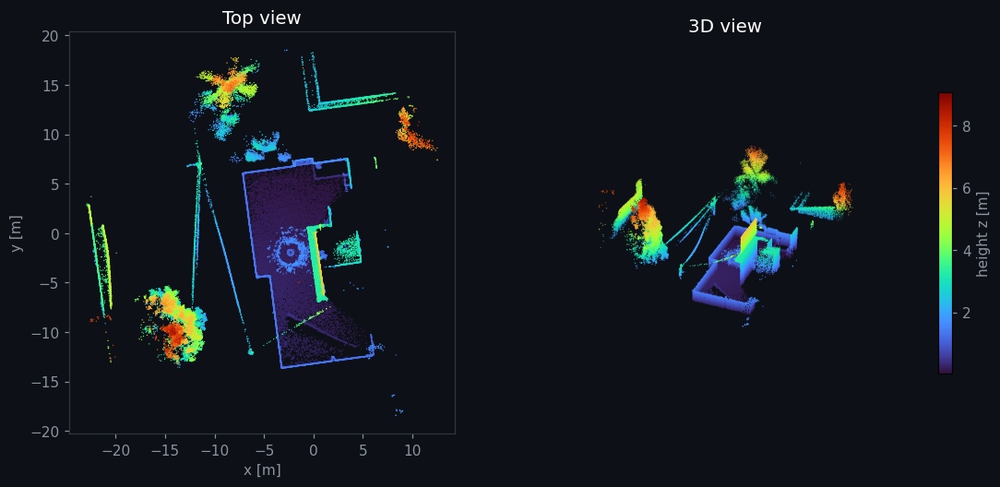
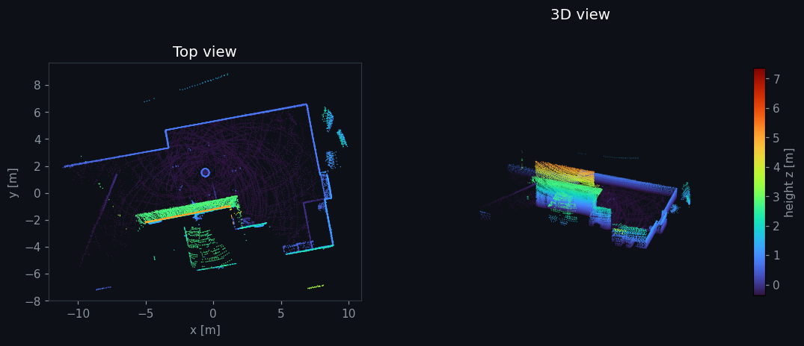

# 3D LiDAR SLAM with the Livox MID-360 on Nvidia Jetson

**A reproducible ROS 2 workspace for 3D map generation with a Livox MID-360, comparing a tightly coupled LiDAR-inertial odometry (FAST-LIO2) with a graph-based NDT SLAM (lidarslam_ros2) on an embedded NVIDIA Jetson.**

[](https://docs.ros.org/en/humble/)
[](https://releases.ubuntu.com/22.04/)
[](https://developer.nvidia.com/embedded/jetson-orin)

Narmeen Sabah Siddiqui · April–May 2025

<div align="center">
  
  <br><em>Figure 1. 3D map built with FAST-LIO2 from the Livox MID-360 (<code>maps/fastlio_map.pcd</code>, 120,761 points, coloured by height). The small ring near the centre of the top view is the oil barrel the device circled during recording.</em>
</div>

---

## Abstract

The Livox MID-360 is a low-cost 360° × 59° solid-state LiDAR with a built-in 6-axis IMU. Its non-repetitive scan pattern makes it attractive for compact robots, but it is unusual among the LiDARs most SLAM pipelines expect. This workspace brings the MID-360 up on ROS 2 Humble on an NVIDIA Jetson Orin Nano and builds 3D maps with two different approaches:

1. **FAST-LIO2:** an iterated error-state Kalman filter that tightly fuses LiDAR points with the IMU, with an incremental k-d tree (ikd-Tree) map.
2. **lidarslam_ros2:** NDT scan matching for the front end, with g2o pose-graph optimisation and loop closure for the back end. This version runs on LiDAR only.

The repository contains the exact package versions and configuration used, the maps produced, and step-by-step instructions to reproduce them. Two further frameworks were tried and not adopted: GLIM and RoboRacer-3DLiDAR. They are listed under [Experiments](#8-experiments-evaluated-but-not-adopted).

---

## Contents

1. [Repository Structure](#1-repository-structure)
2. [Hardware and Tested Environment](#2-hardware-and-tested-environment)
3. [Installation](#3-installation)
4. [Sensor Bring-up (Livox MID-360)](#4-sensor-bring-up-livox-mid-360)
5. [Method A: FAST-LIO2](#5-method-a-fast-lio2)
6. [Method B: lidarslam_ros2 (NDT + Graph SLAM)](#6-method-b-lidarslam_ros2-ndt--graph-slam)
7. [Results and Provided Maps](#7-results-and-provided-maps)
8. [Experiments Evaluated but Not Adopted](#8-experiments-evaluated-but-not-adopted)
9. [Modifications to Upstream Packages](#9-modifications-to-upstream-packages)
10. [Known Issues](#10-known-issues)
11. [Acknowledgements and Licences](#11-acknowledgements-and-licences)

---

## 1. Repository Structure

```
Livox-MID360-3D-SLAM/
├── src/                          # ROS 2 workspace sources
│   ├── livox_ros_driver2/        # Livox ROS 2 driver (MID-360 network config)
│   ├── FAST_LIO_ROS2/            # FAST-LIO2 for ROS 2 (+ ikd-Tree)
│   ├── lidarslam_ros2/           # NDT scan matcher + graph-based SLAM
│   └── ndt_omp_ros2/             # OpenMP NDT used by lidarslam_ros2
├── config/livox_sdk2/            # MID-360 config for the Livox-SDK2 quick-start sample
├── maps/                         # Maps produced in this work (see §7)
├── docs/images/                  # Figures used in this README
└── tools/render_map.py           # Regenerates the map figures from the .pcd files
```

---

## 2. Hardware and Tested Environment

| Item | Details |
|---|---|
| LiDAR | Livox MID-360 (360° × 59° FoV, ~10 Hz point cloud, built-in IMU), connected over Ethernet |
| Computer | NVIDIA Jetson Orin Nano Developer Kit |
| OS | Ubuntu 22.04 LTS (aarch64), JetPack 6 |
| ROS 2 | Humble Hawksbill |
| Livox-SDK2 | [`6a94015`](https://github.com/Livox-SDK/Livox-SDK2/commit/6a94015) |

| Package | Upstream | Version used |
|---|---|---|
| `livox_ros_driver2` | [Livox-SDK/livox_ros_driver2](https://github.com/Livox-SDK/livox_ros_driver2) | `6b9356c` (master) |
| `FAST_LIO_ROS2` | [Ericsii/FAST_LIO_ROS2](https://github.com/Ericsii/FAST_LIO_ROS2) | `18418bc` (ros2) |
| `lidarslam_ros2` | [rsasaki0109/lidarslam_ros2](https://github.com/rsasaki0109/lidarslam_ros2) | `f75a186` (humble) |
| `ndt_omp_ros2` | [rsasaki0109/ndt_omp_ros2](https://github.com/rsasaki0109/ndt_omp_ros2) | `41bdfba` (humble) |

The packages are included in full in `src/`, at the versions above and with the changes listed in [§9](#9-modifications-to-upstream-packages), so a clone builds exactly what was run.

---

## 3. Installation

### Step 1: ROS 2 Humble

Follow <https://docs.ros.org/en/humble/Installation/Ubuntu-Install-Debs.html> (`ros-humble-desktop`).

### Step 2: System dependencies

```bash
sudo apt update && sudo apt install -y \
  git cmake build-essential python3-colcon-common-extensions python3-rosdep \
  libpcl-dev ros-humble-pcl-ros ros-humble-pcl-conversions \
  libeigen3-dev ros-humble-libg2o libapr1-dev \
  ros-humble-tf2-eigen ros-humble-rviz2
```

### Step 3: Livox-SDK2 (system library)

```bash
git clone https://github.com/Livox-SDK/Livox-SDK2.git ~/Livox-SDK2
cd ~/Livox-SDK2 && git checkout 6a94015
mkdir build && cd build && cmake .. && make -j4
sudo make install          # installs liblivox_lidar_sdk_* to /usr/local/lib
```

### Step 4: Clone and build this workspace

```bash
git clone https://github.com/NARMYN/Livox-MID360-3D-SLAM.git ~/Livox-MID360-3D-SLAM
cd ~/Livox-MID360-3D-SLAM
source /opt/ros/humble/setup.bash
rosdep install --from-paths src --ignore-src -r -y
colcon build --symlink-install --cmake-args -DROS_EDITION=ROS2 -DHUMBLE_ROS=humble -DCMAKE_BUILD_TYPE=Release
```

The `-DROS_EDITION` / `-DHUMBLE_ROS` flags are required by `livox_ros_driver2`, and `Release` matters for real-time performance on the Jetson. If the build runs out of memory, add `--parallel-workers 1` and prefix the command with `MAKEFLAGS=-j2`.

### Step 5: Source

In every new terminal:

```bash
source /opt/ros/humble/setup.bash
source ~/Livox-MID360-3D-SLAM/install/setup.bash
```

---

## 4. Sensor Bring-up (Livox MID-360)

### Step 1: Network

The MID-360 talks UDP over Ethernet and needs a static IP on the host's wired interface. In this work:

| Device | IP |
|---|---|
| Host (Jetson, wired interface) | `192.168.1.135` |
| MID-360 | `192.168.1.20` |

```bash
# Example: set the host's wired interface (replace eth0 with yours, see `ip a`)
sudo ip addr add 192.168.1.135/24 dev eth0
ping 192.168.1.20
```

If your addresses differ, edit `host_net_info` (all `*_ip` fields) and `lidar_configs[0].ip` in `src/livox_ros_driver2/config/MID360_config.json`, then rebuild. Optionally, check the connection first with the SDK sample: `~/Livox-SDK2/build/samples/livox_lidar_quick_start/livox_lidar_quick_start config/livox_sdk2/mid360_config.json`.

### Step 2: Launch the driver

The driver must publish in the format each SLAM method expects:

| Launch file | `xfer_format` | Message on `/livox/lidar` | Use with |
|---|---|---|---|
| `rviz_MID360_launch.py` | 0 | `sensor_msgs/PointCloud2` (+ RViz) | **lidarslam_ros2**, visual check |
| `msg_MID360_launch.py` | 1 | `livox_ros_driver2/CustomMsg` | **FAST-LIO2** |

```bash
ros2 launch livox_ros_driver2 rviz_MID360_launch.py   # quick visual check
```

**Checks:** `ros2 topic hz /livox/lidar` gives ~10 Hz, and `ros2 topic hz /livox/imu` gives ~200 Hz.

---

## 5. Method A: FAST-LIO2

### Configuration

`src/FAST_LIO_ROS2/config/mid360.yaml`:

| Parameter | Value | Note |
|---|---|---|
| `common.lid_topic` / `imu_topic` | `/livox/lidar` / `/livox/imu` | MID-360 built-in IMU |
| `preprocess.lidar_type` | 1 | Livox `CustomMsg` |
| `preprocess.scan_line` / `blind` | 4 / 0.5 m | |
| `preprocess.scan_rate` | **40** | changed from 10 (see §9) |
| `filter_size_surf` / `filter_size_map` | 0.5 m / 0.5 m | voxel downsampling |
| `mapping.fov_degree` / `det_range` | 360° / 100 m | |
| `mapping.extrinsic_T` | [−0.011, −0.02329, 0.04412] m | IMU→LiDAR, online refinement on |
| `pcd_save.pcd_save_en` / `interval` | true / −1 | whole map in one file |
| `map_file_path` | `/home/narmyn/livox_ws/mypcd.pcd` | **edit to a path on your machine** |

### Run

```bash
# Terminal 1: driver in CustomMsg format
ros2 launch livox_ros_driver2 msg_MID360_launch.py

# Terminal 2: FAST-LIO2 (opens RViz)
ros2 launch fast_lio mapping.launch.py config_file:=mid360.yaml
```

Move the sensor slowly through the environment, keeping it level at first so the IMU can initialise. When done, save the map:

```bash
ros2 service call /map_save std_srvs/srv/Trigger
```

This writes a binary PCD to `map_file_path`. View it with `pcl_viewer <file>.pcd`, or render it with `python3 tools/render_map.py <file>.pcd out.png`.

---

## 6. Method B: lidarslam_ros2 (NDT + Graph SLAM)

### Configuration

`src/lidarslam_ros2/lidarslam/param/lidarslam.yaml` (unchanged from upstream):

| Component | Parameter | Value |
|---|---|---|
| Scan matcher | registration | NDT, resolution 2.0 m, 2 threads |
| | input / map voxel size | 0.5 m / 0.1 m |
| | range filter | 1.0–200 m |
| | map update after | 1.5 m travel |
| | IMU / odometry | not used (`use_imu: false`, `use_odom: false`) |
| Graph SLAM | registration | NDT, resolution 1.0 m |
| | loop closure | score ≤ 0.7, search radius 20 m, every 3 s |

The launch file remaps the scan matcher's input to `/livox/lidar` and publishes a static `base_link → livox_frame` transform.

### Run

```bash
# Terminal 1: driver in PointCloud2 format
ros2 launch livox_ros_driver2 rviz_MID360_launch.py

# Terminal 2: lidarslam (run from the folder where the map should be saved)
cd ~/Livox-MID360-3D-SLAM/maps
ros2 launch lidarslam lidarslam.launch.py
```

Save the map and pose graph:

```bash
ros2 service call /map_save std_srvs/srv/Empty
```

This writes `map.pcd` (ASCII) and `pose_graph.g2o` to the directory `lidarslam` was launched from.

---

## 7. Results and Provided Maps

**Recording procedure.** Both maps were recorded on a residential rooftop in Karachi, Pakistan, surrounded by trees and neighbouring buildings. The MID-360 was mounted on top of the device, which was moved in a loop around an oil barrel. Circling a single, distinctive object gives the scan matcher a fixed reference visible from every side, and brings the sensor back to its starting view so loop closure can be checked. The barrel appears in both maps as a small ring of points near the centre.

<div align="center">
  
  <br><em>Figure 2. 3D map built with lidarslam_ros2 (<code>maps/lidarslam_map.pcd</code>, 54,489 points). The small circle near the centre is the oil barrel used as the loop reference.</em>
</div>

| File | Method | Recorded | Points | Extent (1st–99th percentile) | Format |
|---|---|---|---|---|---|
| `maps/fastlio_map.pcd` | FAST-LIO2 | 2025-05-10 | 120,761 | 41.7 × 73.8 × 8.5 m | binary PCD (`PointXYZINormal`) |
| `maps/lidarslam_map.pcd` | lidarslam_ros2 | 2025-04-22 | 54,489 | 28.2 × 29.2 × 7.1 m | ASCII PCD (`PointXYZI`) |
| `maps/lidarslam_pose_graph.g2o` | lidarslam_ros2 | 2025-04-22 | 9 poses (SE3), 20 edges | — | g2o |

**Comparison:**
- **FAST-LIO2** fuses the MID-360's IMU with the LiDAR. Its map has 2.2× more points over a larger area (41.7 × 73.8 m), and captures the surrounding trees and building faces up to ~8.5 m in height.
- **lidarslam_ros2** ran on LiDAR only (`use_imu: false`), with NDT scan matching and pose-graph optimisation over 9 keyframes. It also saves the optimised pose graph (`.g2o`), which can be inspected or re-optimised offline.
- The two maps come from different runs, so they show what each pipeline produces rather than a controlled side-by-side benchmark.

To regenerate the figures:

```bash
python3 tools/render_map.py maps/fastlio_map.pcd   docs/images/fastlio_map.png
python3 tools/render_map.py maps/lidarslam_map.pcd docs/images/lidarslam_map.png
```

---

## 8. Experiments Evaluated but Not Adopted

These frameworks were cloned and built on the same Jetson while choosing a pipeline. They are not part of this workspace and are cited here for completeness.

| Framework | Source | What was done | Outcome |
|---|---|---|---|
| **GLIM**: GPU-accelerated LiDAR-IMU mapping | [koide3/glim](https://github.com/koide3/glim), [koide3/glim_ros2](https://github.com/koide3/glim_ros2) | Installed `ros-humble-glim-ros-cuda12.6` 1.0.8 and built from source with its dependencies [GTSAM](https://github.com/borglab/gtsam) 4.2, [gtsam_points](https://github.com/koide3/gtsam_points) and [iridescence](https://github.com/koide3/iridescence) | Built but not run for mapping |
| **RoboRacer-3DLiDAR**: MID-360 integration for RoboRacer/F1TENTH cars | [TUM-AVS/RoboRacer-3DLiDAR](https://github.com/TUM-AVS/RoboRacer-3DLiDAR) | Cloned at `a91c180`; adapted the bundled `livox_ros_driver2` build files for Humble | Workspace build not completed. Its `lidarslam_ros2` launch configuration (MID-360 topics and frames) was adopted in Method B using the upstream packages |
| **livox_ros_driver2** (first checkout) | [Livox-SDK/livox_ros_driver2](https://github.com/Livox-SDK/livox_ros_driver2) | Initial driver test in a separate tutorial workspace | Superseded by the configured driver in `src/` |

---

## 9. Modifications to Upstream Packages

All changes are configuration; no algorithm source code was changed.

| Package | File | Change |
|---|---|---|
| `livox_ros_driver2` | `config/MID360_config.json` | Host IPs `192.168.1.5` → `192.168.1.135` (including `log_data_ip`); LiDAR IP `192.168.1.12` → `192.168.1.20` |
| `FAST_LIO_ROS2` | `config/mid360.yaml` | `scan_rate` 10 → 40; `map_file_path` set to a fixed output file |
| `lidarslam_ros2` | `lidarslam/launch/lidarslam.launch.py` | Input `/velodyne_points` → `/livox/lidar`; static TF child frame `velodyne` → `livox_frame` |
| `lidarslam_ros2` | `scanmatcher/launch/mapping_robot.launch.py` | Input → `/livox/lidar`, IMU → `/livox/imu`; TF child frame → `livox_frame` |
| `lidarslam_ros2` | `Thirdparty/ndt_omp_ros2` | Removed the bundled submodule; `ndt_omp_ros2` is built as its own package in `src/` |
| `FAST_LIO_ROS2` | `doc/` | Removed upstream demo images and videos (~120 MB) to keep the repository small |
| Livox-SDK2 | `samples/livox_lidar_quick_start/mid360_config.json` | Host IP → `192.168.1.135`, multicast disabled (copy in `config/livox_sdk2/`) |

---

## 10. Known Issues

- **`map_file_path`** in `mid360.yaml` is an absolute path from the original machine. Change it before running, or `/map_save` will fail to write.
- **FAST-LIO2 `scan_rate: 40`** is higher than the MID-360's 10 Hz publish rate. The value was kept because the maps in §7 were produced with it. Try 10 if you see timestamp-related warnings.
- **`lidarslam.launch.py`** remaps `/imu` to `/sensors/imu/raw` (inherited from RoboRacer-3DLiDAR), a topic the MID-360 doesn't publish. This has no effect because `use_imu` is `false`. To enable the IMU, set `use_imu: true` and remap to `/livox/imu` (as `mapping_robot.launch.py` does).
- **The upstream FAST-LIO README** references images in `doc/`, which were removed here; see the [upstream repository](https://github.com/Ericsii/FAST_LIO_ROS2) for them.

---

## 11. Acknowledgements and Licences

This workspace is built entirely on open-source work. All credit for the algorithms and drivers goes to their authors:

| Package | Authors | Licence |
|---|---|---|
| [livox_ros_driver2](https://github.com/Livox-SDK/livox_ros_driver2), [Livox-SDK2](https://github.com/Livox-SDK/Livox-SDK2) | Livox Technology | MIT |
| [FAST_LIO_ROS2](https://github.com/Ericsii/FAST_LIO_ROS2) (port of [FAST-LIO](https://github.com/hku-mars/FAST_LIO)) | Ericsii; W. Xu, F. Zhang et al., HKU MARS Lab | GPL-2.0 |
| [lidarslam_ros2](https://github.com/rsasaki0109/lidarslam_ros2), [ndt_omp_ros2](https://github.com/rsasaki0109/ndt_omp_ros2) | Ryohei Sasaki; NDT-OMP by Kenji Koide | BSD-2-Clause |

Each package in `src/` keeps its original `LICENSE` file, which governs its use. If you use FAST-LIO2 in research, please cite:

```bibtex
@article{xu2022fastlio2,
  title   = {FAST-LIO2: Fast Direct LiDAR-Inertial Odometry},
  author  = {Xu, Wei and Cai, Yixi and He, Dongjiao and Lin, Jiarong and Zhang, Fu},
  journal = {IEEE Transactions on Robotics},
  volume  = {38},
  number  = {4},
  pages   = {2053--2073},
  year    = {2022}
}
```
